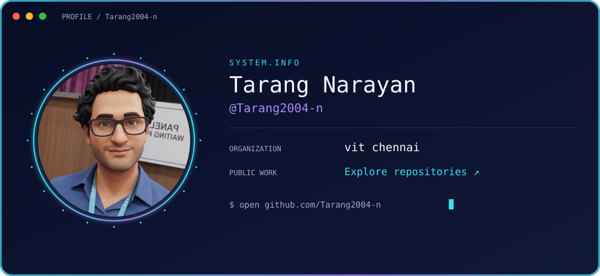
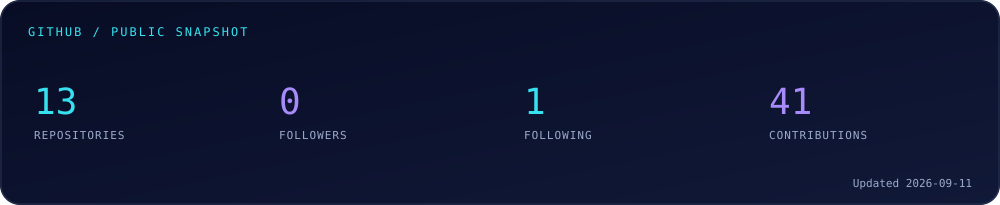
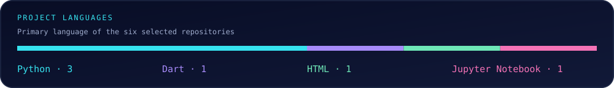
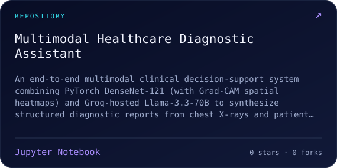
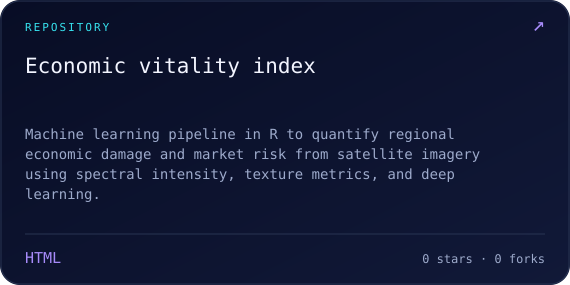
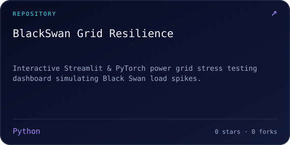
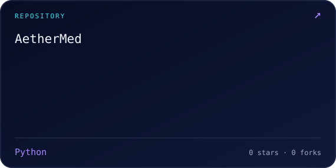
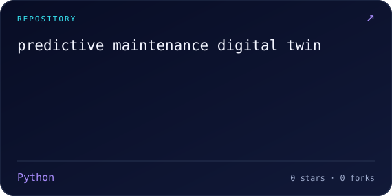
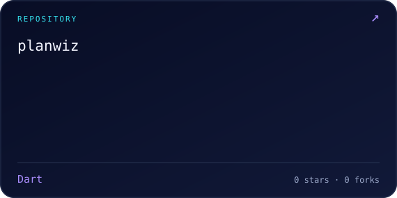

  <picture><source media="(max-width: 640px)" srcset="assets/hero-mobile.svg"></picture>

 

  <a href="https://github.com/Tarang2004-n?tab=repositories">Explore my repositories ↗</a>

 

  <picture><source media="(max-width: 640px)" srcset="assets/dashboard-mobile.svg"></picture>
  

My public projects include multimodal healthcare, satellite-based economic analysis, and power-grid stress testing.

<h2 align="center">SELECTED REPOSITORIES</h2>

<table width="100%">
  <tr>
    <td width="50%"></td>
    <td width="50%"></td>
  </tr>
  <tr>
    <td width="50%"></td>
    <td width="50%"></td>
  </tr>
  <tr>
    <td width="50%"></td>
    <td width="50%"></td>
  </tr>
</table>

 

  PROFILE.SYS · <a href="https://github.com/Tarang2004-n">Tarang2004-n</a>

